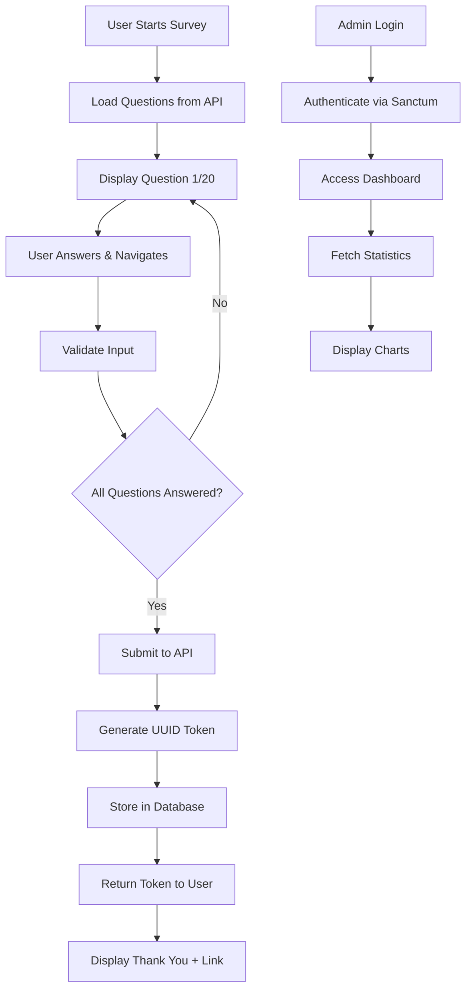

# Survey Platform Architecture

## Frontend Implementation Summary

- Survey page: Progress bar, question navigation, validation, submission (20 mandatory questions, email validation for Q1).
- Response page: Display all questions and answers in dotted boxes (accessed via unique token URL).
- Admin panel: Login at `/administration`, sidebar, dashboard charts (Pie & Radar), questionnaire table, responses table.
- Responsive, modern UI: Sidebar fixed, content scrolls, validation errors shown, dotted borders for question boxes.
- API integration: Axios for backend, sample JSON for development.

## Sample Data

- `src/data/questions.json`: Sample survey questions.
- `src/data/responses.json`: Sample responses for UI testing.

## Project Overview
A full-stack customer satisfaction survey platform with public survey interface, response viewing, and admin dashboard.

## Technology Stack

### Backend (Laravel 10)
- **Framework**: Laravel 10
- **Database**: MySQL
- **Authentication**: Laravel Sanctum
- **API**: RESTful JSON API
- **Testing**: PHPUnit
- **CORS**: fruitcake/laravel-cors

### Frontend (React)
- **Framework**: React 18 with Vite
- **Routing**: react-router-dom v6
- **HTTP Client**: Axios
- **UI Framework**: TailwindCSS + Material UI
- **Charts**: Chart.js with react-chartjs-2
- **State Management**: React Context API
- **Form Validation**: Custom hooks

## Database Schema

### Tables

#### questions
- id (bigint, primary key)
- question_text (text)
- type (enum: 'A', 'B', 'C')
- options (json, nullable)
- created_at (timestamp)
- updated_at (timestamp)

#### responses
- id (bigint, primary key)
- token (uuid, unique, indexed)
- email (varchar 255)
- created_at (timestamp)
- updated_at (timestamp)

#### answers
- id (bigint, primary key)
- response_id (bigint, foreign key)
- question_id (bigint, foreign key)
- answer_text (text)
- created_at (timestamp)
- updated_at (timestamp)

## Survey Questions (Customer Satisfaction)

### Type A - Multiple Choice Questions
1. **Email** (Type B - Text Input)
   - "What is your email address?"
   - Validation: email format

2. **Overall Satisfaction** (Type A)
   - "How satisfied are you with our product/service overall?"
   - Options: Very Satisfied, Satisfied, Neutral, Dissatisfied, Very Dissatisfied

3. **Product Quality** (Type A)
   - "How would you rate the quality of our product?"
   - Options: Excellent, Good, Average, Poor, Very Poor

4. **Value for Money** (Type A)
   - "How would you rate the value for money of our product/service?"
   - Options: Excellent, Good, Fair, Poor, Very Poor

5. **Customer Service** (Type A)
   - "How satisfied are you with our customer service?"
   - Options: Very Satisfied, Satisfied, Neutral, Dissatisfied, Very Dissatisfied

6. **Purchase Frequency** (Type A) - *Used in Dashboard Pie Chart*
   - "How often do you purchase from us?"
   - Options: Weekly, Monthly, Quarterly, Yearly, First Time

7. **Recommendation Likelihood** (Type A) - *Used in Dashboard Pie Chart*
   - "How likely are you to recommend us to others?"
   - Options: Very Likely, Likely, Neutral, Unlikely, Very Unlikely

8. **Preferred Contact Method** (Type A)
   - "What is your preferred method of contact?"
   - Options: Email, Phone, Chat, Social Media, In-Person

9. **Problem Resolution** (Type A)
   - "How well were your issues resolved?"
   - Options: Completely Resolved, Mostly Resolved, Partially Resolved, Not Resolved, N/A

10. **Product Category** (Type A) - *Used in Dashboard Pie Chart*
    - "Which product category do you purchase most?"
    - Options: Electronics, Clothing, Food & Beverage, Home & Garden, Other

### Type C - Numeric Scale Questions (1-5)
11. **Ease of Use** (Type C) - *Used in Radar Chart*
    - "Rate the ease of use of our product (1-5)"
    - Scale: 1 (Very Difficult) to 5 (Very Easy)

12. **Product Features** (Type C) - *Used in Radar Chart*
    - "Rate the features of our product (1-5)"
    - Scale: 1 (Poor) to 5 (Excellent)

13. **Delivery Speed** (Type C) - *Used in Radar Chart*
    - "Rate our delivery speed (1-5)"
    - Scale: 1 (Very Slow) to 5 (Very Fast)

14. **Website Experience** (Type C) - *Used in Radar Chart*
    - "Rate your website/app experience (1-5)"
    - Scale: 1 (Poor) to 5 (Excellent)

15. **Price Competitiveness** (Type C) - *Used in Radar Chart*
    - "Rate our pricing compared to competitors (1-5)"
    - Scale: 1 (Much Higher) to 5 (Much Lower)

### Type B - Text Input Questions
16. **Improvement Suggestions** (Type B)
    - "What improvements would you suggest for our product/service?"
    - Max: 255 characters

17. **Best Feature** (Type B)
    - "What do you like most about our product/service?"
    - Max: 255 characters

18. **Biggest Challenge** (Type B)
    - "What is your biggest challenge with our product/service?"
    - Max: 255 characters

19. **Additional Products** (Type B)
    - "What additional products/services would you like us to offer?"
    - Max: 255 characters

20. **Additional Comments** (Type B)
    - "Any additional comments or feedback?"
    - Max: 255 characters

## API Endpoints

### Public Endpoints
```
GET  /api/questions          - Get all survey questions
POST /api/responses          - Submit survey response
GET  /api/responses/{token}  - Get response by token
```

### Admin Endpoints (Protected)
```
POST /api/admin/login        - Admin login
POST /api/admin/logout       - Admin logout
GET  /api/admin/dashboard    - Dashboard statistics
GET  /api/admin/questionnaire - Get all questions
GET  /api/admin/responses    - Get all responses
```

## Security Measures

1. **Authentication**
   - Laravel Sanctum for API token authentication
   - Admin login with email/password
   - Token stored in localStorage (frontend)

2. **Authorization**
   - Middleware protection for admin routes
   - Role-based access control

3. **Data Protection**
   - UUID tokens for response URLs (no sequential IDs)
   - Rate limiting on POST endpoints
   - CORS configuration for frontend domain
   - Input validation and sanitization

4. **Best Practices**
   - HTTPS enforcement in production
   - Environment variables for sensitive data
   - SQL injection prevention via Eloquent ORM
   - XSS protection via React's default escaping

## Frontend Routes

### Public Routes
- `/` - Survey form
- `/response/:token` - View submitted response
- `/thank-you` - Thank you page after submission

### Admin Routes (Protected)
- `/admin/login` - Admin login
- `/admin/dashboard` - Dashboard with charts
- `/admin/questionnaire` - View all questions
- `/admin/responses` - View all responses

## Component Architecture

### Shared Components
- `Button` - Reusable button component
- `InputField` - Form input wrapper
- `LoadingSpinner` - Loading indicator
- `ErrorMessage` - Error display

### Survey Components
- `SurveyForm` - Main survey container
- `Question` - Individual question renderer
- `QuestionNavigation` - Previous/Next/Submit buttons
- `ProgressBar` - Survey progress indicator

### Admin Components
- `Sidebar` - Navigation sidebar
- `ChartCard` - Chart container
- `DataTable` - Responsive data table
- `ProtectedRoute` - Route guard wrapper

## Data Flow



## Deployment Considerations

1. **Environment Setup**
   - Separate .env files for development/production
   - Database migrations and seeding scripts
   - Composer and NPM dependency management

2. **Performance**
   - API response caching for questions
   - Lazy loading for admin dashboard
   - Pagination for response lists

3. **Monitoring**
   - Laravel logging for errors
   - API response time tracking
   - User behavior analytics (optional)

## Testing Strategy

1. **Backend Tests**
   - Feature tests for all API endpoints
   - Unit tests for services
   - Database seeding for test data

2. **Frontend Tests**
   - Component testing with React Testing Library
   - E2E testing with Cypress (optional)
   - Form validation testing

3. **Integration Tests**
   - API integration tests
   - Authentication flow tests
   - Data persistence tests